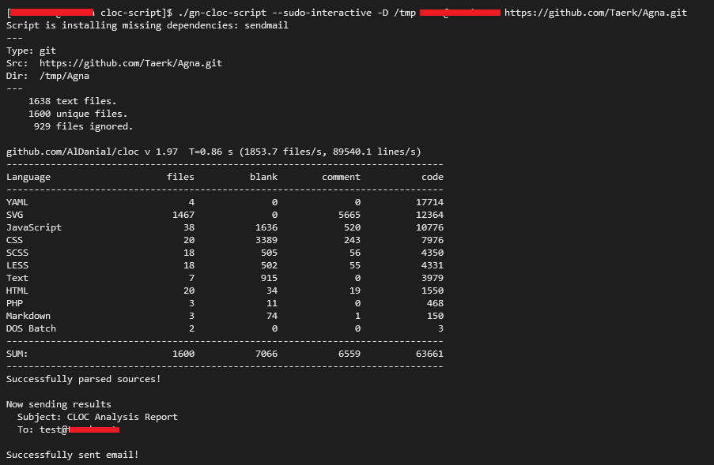
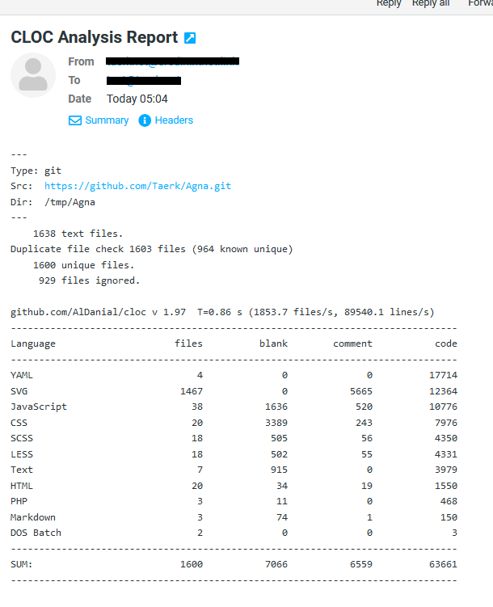
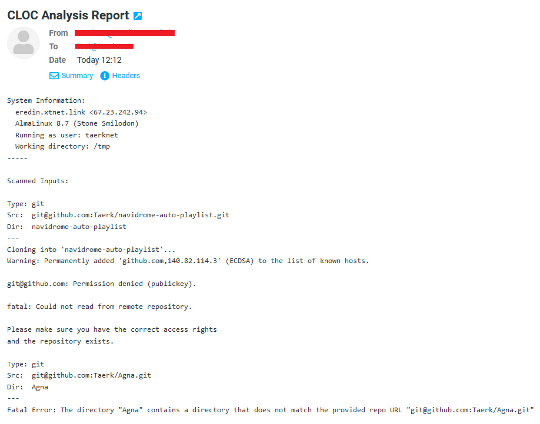

# GN CLOC Script

## Summary

Runs [cloc](https://cloc.sourceforge.net/) against a provided repo, file(s), or stdin and sends the result to a configured email address.

```
gn-cloc-script [option]... [-t to-addr|to-addr] repourl...
gn-cloc-script [option]... --files [-t to-addr|to-addr] file...
gn-cloc-script [option]... --stdin [-t to-addr|to-addr]
```

## System Requirements

The following requirements are required for the script to run:
- BASH 3+
- One of the following package managers:
  * yum/dnf
  * apt
- Software dependencies:
  * cloc
  * mailx
  * sed
  * coreutils
- A functioning mail server (i.e. sendmail, postfix, exim)

These conditions are met by most versions of RHEL, Fedora, and Ubuntu.

**The script will attempt to install the dependencies if they're not present with non-interactive sudo unless `--sudo-interactive` is specified.**

## Options

gn-cloc-script comes with many configurable options to adjust the scanning and mailing behavior.

### General Options

#### `-h`, `--help`
Show this help page.

#### `-v`, `--verbose`

Run script with verbose output.

#### `-vv`, `--debug`

Run script with debug output.

#### `-D`, `--clone-dir directory`

Directory to clone repositories to. If not set, it will clone the repositories to the current running directory.

#### `--sudo-interactive`

Disables non-interactive mode of sudo when attempting to install packages.

### PARSING OPTIONS
#### `-G`, `--git`, `--repo`
Clone a provided git repo URL to be scanned. This is the default behavior.

#### `-F`, `--files`
Parse the provided file list to be scanned.

#### `-S`, `--stdin`
Parse the provided stdin to be scanned.

#### `--cloc-options options...`
Passes provided options to the cloc command.

Example:
```
gn-cloc-script --cloc-options="--stdin --stat"
```

### EMAIL OPTIONS

The script provides various methods for adjusting the email settings. Options can be used or environment variables can be used. Refer to the arguments below for available environment variables for each setting.

#### The environment variables can also be saved in ~/cloc_config and will be auto-loaded by the script.

#### `-t`, `--to to-addr`
Set the destination address for the email. This is a required setting either through this argument or as an argument for the script.

This can also be set with the `CLOC_MAILX_TO` environment variable.

#### `-s`, `--subject value`
Set the subject for the resulting email notification. If not set, it will default to "CLOC Analysis Report".

This can also be set with the `CLOC_MAILX_SUBJECT` environment variable.

#### `-f`, `--from from-addr`
Set the from address email notification. If not set, it will default the system's default address.

This can also be set with the `CLOC_MAILX_FROM` environment variable.

#### `-c`, `--cc cc-addr`
Set the cc for the notification email. Use commas to separate multiple emails.

This can also be set with the `CLOC_MAILX_CC` environment variable.

#### `-b`, `--bcc bcc-addr`
Set the bcc for the notification email. Use commas to separate multiple emails.

This can also be set with the `CLOC_MAILX_BCC` environment variable.

# Examples

Below is an example of the code being run successfully:



In addition to the resulting email:



## Errors

Below is a sample email with a scan requested on two different repositories. There are different errors on each one.

* The first scan failed due to not having permissions to clone the repository.
* The second scan failed due to a directory for the repository already existing and not matching the requested repository.
  - This can be resolved by either moving the existing directory, removing it, or using `-D` to change the directory to clone the repository to.

